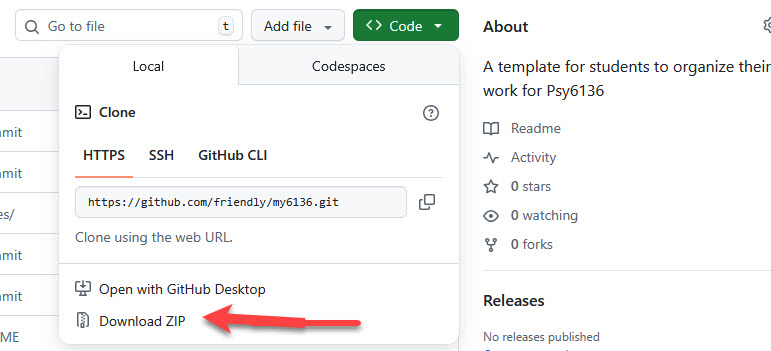
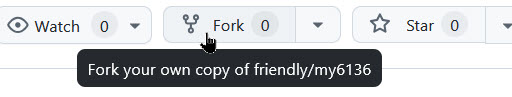
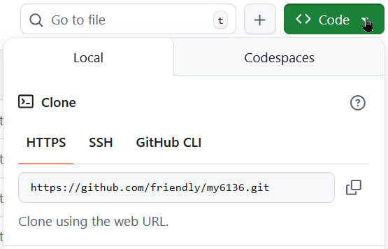

<!-- README.md is generated from README.Rmd. Please edit that file -->

```{r, include = FALSE}
knitr::opts_chunk$set(
  collapse = TRUE,
  comment = "#>"
)
```

# my6136 

<!-- badges: start -->
<!-- badges: end -->

This GitHub repo provides a template you can use to organize your work for
[Psy6136: Categorical Data Analysis](https://friendly.github.io/psy6136/) (or any course). It provides:

* A reasonable organization of folders for your work. Feel free to add any others

```{r eval=FALSE, echo=FALSE}
fs::dir_tree(recurse = FALSE)
```

```
my6136
  ├── assign
  ├── data
  ├── images
  ├── notes
  ├── R
  └── tutorials
```

* Some templates for using Rmarkdown in assignments or projects and also for setting up R scripts so you "compile" them with [knitr](https://yihui.org/knitr/) to produce
output in HTML, DOCX, PDF, ... The following are provided, just to get you started:

  * [Assignment template](assign/assign-template.R): Simple template for using an R script for an assignment. This appears like this in [HTML](assign/assign-template.html) when you `knitr` it.
  * [Rmarkdown template](R/RMarkdown-template.Rmd): For a report, with more text than code. Code is in R "chunks"
  * [R script template](R/RScript-template.R): For an R script, with output rendered to HTML, DOCX, or PDF

```{r echo=FALSE, eval=FALSE}
fs::dir_ls(regexp = ".*template.*", recurse = TRUE) |> 
  paste(collapse = "\n") |> 
  cat()
```


## Getting started

I recommend that you set up an [RStudio project](https://support.posit.co/hc/en-us/articles/200526207-Using-RStudio-Projects) for your work in the course, where you can organize your notes and work on assignments, projects, etc.

This repository on GitHub: [my6136](https://github.com/friendly/my6136) provides a template for this.
You can simply download the ZIP file to your computer, unzip it, and then open it in RStudio (double-click on the file `my6136.Rproj`). 



### Using GitHub
If you are comfortable using GitHub, you can simply fork & clone this repo to your own account.
Details on this are given in [fork and clone this repo](https://github.com/rstats-tln/fork-and-clone-repo). The images below show
what's involved for `my6136`. 


&nbsp; &nbsp;


If you don't yet use GitHub, you can easily [create a GitHub account](https://docs.github.com/en/get-started/start-your-journey/creating-an-account-on-github) (**highly recommended**: Your future self will thank me!)


## Installing packages

You will need a bunch of R packages for this course. The file [`R/install-vcd-packages.R`](R/install-vcd-packages.R) contains the ones I recommend. Simply run this in RStudio.

### PDF output

In RStudio, rendering scripts and `.Rmd` files to PDF uses [`pandoc`](https://pandoc.org/) to convert to LaTeX `.tex` files and then working `LaTeX`
installation to convert to PDF. The R package [tinytex](https://yihui.org/tinytex/) makes this relatively easy.

<!--
### Citations

In your
-->

## Learning to use Git and GitHub

For more details on using Git and Github for working with R, 
see: 

* Jenny Bryan's [Getting Started with GitHub](https://jennybc.github.io/2014-05-12-ubc/ubc-r/session2.4_github.html)
* [How to use Git and GitHub with R](https://rfortherestofus.com/2021/02/how-to-use-git-github-with-r)


